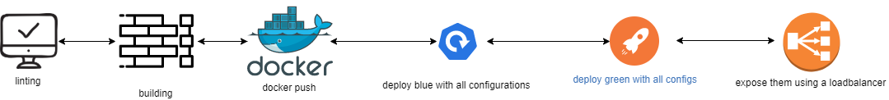

# DevOps, Microservices

The project's goal is to deploy a microservice in a highly available Kubernetes cluster.

The had created calulator using python flask frame work, containerised it using docker and deployed it using k8s. I ensured Node affinity, Pod Disruption budget, offload TLS at the load balancer/ingress are working before it is served with traffic.

## Requirements

    1. You have to install

        - [Jenkins](https://www.jenkins.io/doc/book/installing/)
        - [Docker](https://docs.docker.com/engine/install/ubuntu/)
        - [Kubectl](https://kubernetes.io/docs/tasks/tools/install-kubectl/)
        - [aws-cli](https://docs.aws.amazon.com/cli/latest/userguide/install-cliv2-linux.html)
        - [eksctl](https://docs.aws.amazon.com/eks/latest/userguide/getting-started-eksctl.html)

    2. All these dependent apps should be installed and configured using your credentials. 
    3. Docker need to be added to Sudo group to prevent permission issues.
    4. Repository need to be added to be Jenkins pipeline, so the deployment can be automated in Jenkins.

## Deployment strategy

Used blue/green deployment strategy because it reduces downtime by running two identical environments with only one serving at a given time

Fallowing pipelines are created to automate the deployment process

- [cluster formation](https://github.com/ph4n666/cluster-formation-) - creates a Kubernetes cluster using eksctl and updates the Jenkins server with the respective config file.

- [Jenkins Pipeline](https://github.com/ph4n666/jenkins-pipeline)(This is the project)

This pipeline does the following steps

1. Builds the docker images and creates containers out of them.
2. Sets labels to nodes so that can used to achieve node affinity
3. Deploys blue and green deployments
4. Istalls metrics server for horizontal pod autoscaling
5. Adds pod disruption budget to both blue and green deployments
6. Exposes the deployments using a load balancer at port 8080

## Note
To use ingress, expose the application through NodePort and Run

- Kubectl apply -f ingress.yml

I haven't used it as I do not have a registered domain name.

Also, refer to images of deployment for a better understanding

